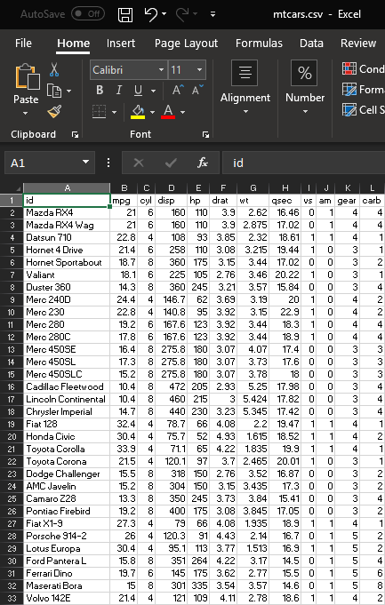

# [atet](https://github.com/atet) / [learn](https://github.com/atet/learn) / [tableau](https://github.com/atet/learn/tree/master/tableau)

# Introduction to Tableau

* This quick introduction to [Tableau software](https://en.wikipedia.org/wiki/Tableau_Software) is meant to cover only the absolute necessary material to get you up and running in a minimal amount of time.
* You are here because you want to use Tableau to visualize data from a data source (e.g. database, spreadsheet, etc.).
* We will be using [Tableau Public (Free)](https://public.tableau.com/en-us/s/) to perform basic operations, advanced material is not covered here.

--------------------------------------------------------------------------------------------------

### Table of Contents

* [Installation](#installation)
* [Example Data](#example-data)
* 
* 
* 
* 
* 
* 
* 
* 
* 
* 
* 
* 
* 
* 
* 
* 
* 
* 
* 
* 
* [Limitations of Tableau Public](#limitations-of-tableau-public)
* [Acknowledgements](#acknowledgements)

--------------------------------------------------------------------------------------------------

### Installation

* Download and install Tableau Public from: [https://public.tableau.com/en-us/s/download](https://public.tableau.com/en-us/s/download)
* I am using Tableau Public version 2019.3 for this tutorial.

[Back to Top](#table-of-contents)

--------------------------------------------------------------------------------------------------

### Example Data

* We will use a small dataset of vehicles as an example[[1]](#acknowledgements).
* Download the dataset from (right-click and "Save As"): [https://raw.githubusercontent.com/atet/learn/master/tableau/data/mtcars.csv](https://raw.githubusercontent.com/atet/learn/master/tableau/data/mtcars.csv)

[Back to Top](#table-of-contents)

--------------------------------------------------------------------------------------------------

### 

[Back to Top](#table-of-contents)

--------------------------------------------------------------------------------------------------

### 

[Back to Top](#table-of-contents)

--------------------------------------------------------------------------------------------------

### 

[Back to Top](#table-of-contents)

--------------------------------------------------------------------------------------------------

### 

[Back to Top](#table-of-contents)

--------------------------------------------------------------------------------------------------

### 

[Back to Top](#table-of-contents)

--------------------------------------------------------------------------------------------------

### 

[Back to Top](#table-of-contents)

--------------------------------------------------------------------------------------------------

### 

[Back to Top](#table-of-contents)

--------------------------------------------------------------------------------------------------

### 

[Back to Top](#table-of-contents)

--------------------------------------------------------------------------------------------------

### 

[Back to Top](#table-of-contents)

--------------------------------------------------------------------------------------------------

### 

[Back to Top](#table-of-contents)

--------------------------------------------------------------------------------------------------

### 

[Back to Top](#table-of-contents)

--------------------------------------------------------------------------------------------------

### 

[Back to Top](#table-of-contents)

--------------------------------------------------------------------------------------------------

### 

[Back to Top](#table-of-contents)

--------------------------------------------------------------------------------------------------

### 

[Back to Top](#table-of-contents)

--------------------------------------------------------------------------------------------------

### 

[Back to Top](#table-of-contents)

--------------------------------------------------------------------------------------------------

### 

[Back to Top](#table-of-contents)

--------------------------------------------------------------------------------------------------

### 

[Back to Top](#table-of-contents)

--------------------------------------------------------------------------------------------------

### 

[Back to Top](#table-of-contents)

--------------------------------------------------------------------------------------------------

### 

[Back to Top](#table-of-contents)

--------------------------------------------------------------------------------------------------

### 

[Back to Top](#table-of-contents)

--------------------------------------------------------------------------------------------------

### Limitations of Tableau Public

* Tableau Public is a free version of the subscription-based Tableau Desktop and does not have full functionality. Limitations include:
   * Data can only be uploaded as a spreadsheet (e.g. Excel files). Database connections are disabled.
   * Limit of 10 million rows.
   * Automation is disabled.
   * Everything is saved/published to their cloud and can be seen by the public. Local "save to desktop" is disabled.
* For a details of limitations: [https://community.tableau.com/docs/DOC-9135](https://community.tableau.com/docs/DOC-9135).

[Back to Top](#table-of-contents)

--------------------------------------------------------------------------------------------------

### Acknowledgements

1. mtcars data set from R, [Henderson and Velleman (1981), Building multiple regression models interactively. Biometrics, 37, 391–411.](https://stat.ethz.ch/R-manual/R-devel/library/datasets/html/mtcars.html)

[Back to Top](#table-of-contents)

--------------------------------------------------------------------------------------------------