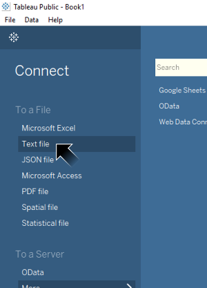
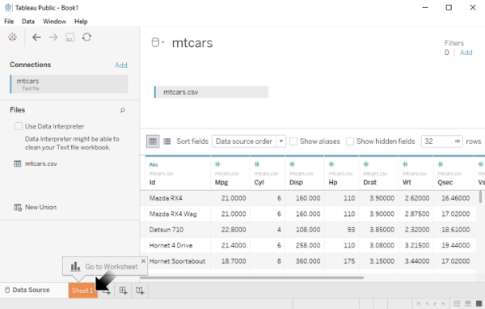
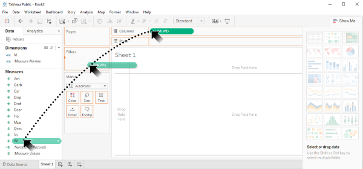
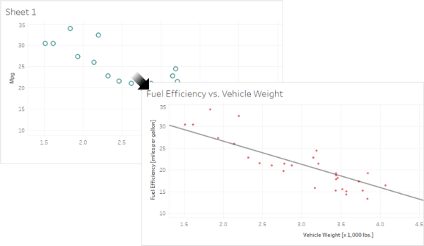

# [atet](https://github.com/atet) / [learn](https://github.com/atet/learn) / [tableau](https://github.com/atet/learn/tree/master/tableau)

# Introduction to Tableau

* Estimated time to completion: 15 minutes.
* This quick introduction to <a href="https://en.wikipedia.org/wiki/Tableau_Software" target="_blank">Tableau software</a> is meant to cover only the absolute necessary material to get you up and running in a minimal amount of time.
* You are here because you want to use Tableau to visualize data from a data source (e.g. database, spreadsheet, etc.).
* We will be using <a href="https://public.tableau.com/en-us/s/" target="_blank">Tableau Public (Free)</a> to perform basic operations; advanced material is not covered here.

--------------------------------------------------------------------------------------------------

### Table of Contents

#### Introduction
* [0. Requirements](#0-requirements)
* [1. Installation](#1-installation)
* [2. Example Data](#2-example-data)
* [3. Loading Data](#3-loading-data)
* [4. Tabs](#4-tabs)
* [5. Your First Visualization](#5-your-first-visualization)
* [6. Saving and Publishing](#6-saving-and-publishing)
* [7. Customization](#7-customization)
* [8. Experiment](#8-experiment)

#### Supplemental
* [Limitations of Tableau Public](#limitations-of-tableau-public)
* [Acknowledgements](#acknowledgements)

--------------------------------------------------------------------------------------------------

### 0. Requirements

* This tutorial was developed on Microsoft Windows 10.
* Tableau is also available for MacOS 10.13+.

[Back to Top](#table-of-contents)

--------------------------------------------------------------------------------------------------

### 1. Installation

* Download and install Tableau Public from: <a href="https://public.tableau.com/en-us/s/download" target="_blank">https://public.tableau.com/en-us/s/download</a>
* I am using Tableau Public version 2019.3 for this tutorial.
* You must sign up for a free account with Tableau Public (<a href="https://public.tableau.com" target="_blank">https://public.tableau.com</a>) to save and publish your work.
   * NOTE: A regular Tableau account will not work with Tableau Public, they are two separate accounts.

#### After downloading and installing Tableau Public and registering for an account, you should be able to publish your first Tableau visualization within the next 10 minutes.

[Back to Top](#table-of-contents)

--------------------------------------------------------------------------------------------------

### 2. Example Data

* We will use a small dataset of vehicles as an example[[1]](#acknowledgements).
* Click here for the dataset (right-click and "Save as..." then save as _mtcars.csv_): <a href="https://raw.githubusercontent.com/atet/learn/master/tableau/data/mtcars.csv" target="_blank">https://raw.githubusercontent.com/atet/learn/master/tableau/data/mtcars.csv</a>
* This Comma Separated Values (CSV) file contains 32 records of vehicles and 12 attributes describing them (e.g. "id" = name, "mpg" = miles per gallon, etc.):

[Back to Top](#table-of-contents)

--------------------------------------------------------------------------------------------------

### 3. Loading Data

* Open Tableau Public.
* On left-hand side, click on "Text file".
* Navigate to where you saved _mtcars.csv_ and open it.

[Back to Top](#table-of-contents)

--------------------------------------------------------------------------------------------------

### 4. Tabs

* Once the _mtcars.csv_ data is loaded, you will be looking at the Source Data tab.
* Navigate to worksheet **Sheet1** at the bottom to make our first visualization.

[Back to Top](#table-of-contents)

--------------------------------------------------------------------------------------------------

### 5. Your First Visualization

* This worksheet is where visualizations are made.
* Tableau has automatically organized the data on the left-hand side as **Dimensions** or **Measures**.
* The 32 individual records are represented by just the attribute's column name here for simplicity.

* Let's make a **scatter plot** to explore the relationship between a vehicle's weight ("wt") and its fuel efficiency ("mpg").
* Drag "wt" into Columns.

* Drag "mpg" into Rows.
* Tableau automatically made an incorrect visualization by using the _sum_ of "wt" and "mpg" (which results in a single data point).
* **This is not how we wanted to visualize this**: Right-click on both "wt" and "mpg" and change from *Measure (Sum)* to *Dimension*.
* After those changes, Tableau has automatically resized the window to fit all 32 data points.

[Back to Top](#table-of-contents)

--------------------------------------------------------------------------------------------------

### 6. Saving and Publishing

* Tableau Public will only allow you to save your analyses and visualization to their public cloud (everyone can see your work). This is the only option for the free Tableau Public software.
* Go to "Save to Tableau Public As..."
* A window will pop up to log into your account if you have not done so already.

* Once you save, your work will automatically be published to your cloud account and accessible to the public.
* My example here has been published to: <a href="https://public.tableau.com/profile/atet.kao#!/vizhome/mtcars_15711875697030/Sheet1?publish=yes" target="_blank">https://public.tableau.com/profile/atet.kao#!/vizhome/mtcars_15711875697030/Sheet1?publish=yes</a>

[Back to Top](#table-of-contents)

--------------------------------------------------------------------------------------------------

### 7. Customization

* Tableau will allow you to add a title, rename axes, change colors, add a trend line, etc.

[Back to Top](#table-of-contents)

--------------------------------------------------------------------------------------------------

### 8. Experiment

* Play around with the software, make new worksheets with interesting visualizations.
* Find new data on the internet and learn new ways to use Tableau.
* If you are an Excel and/or R user, think about how your analysis workflow would be different using Tableau.
* Resources:

Description | Link
--- | ---
Sample Data | <a href="https://public.tableau.com/en-us/s/resources?qt-overview_resources=1#qt-overview_resources" target="_blank">https://public.tableau.com/en-us/s/resources?qt-overview_resources=1#qt-overview_resources</a>
How-To Videos | <a href="https://public.tableau.com/en-us/s/resources?qt-overview_resources=0#qt-overview_resources" target="_blank">https://public.tableau.com/en-us/s/resources?qt-overview_resources=0#qt-overview_resources</a>

[Back to Top](#table-of-contents)

--------------------------------------------------------------------------------------------------

### Limitations of Tableau Public

* Tableau Public is a free version of the subscription-based Tableau Desktop and does not have full functionality. Limitations include:
   * Data can only be uploaded as a spreadsheet (e.g. Excel files). Database connections are disabled.
   * Limit of 10 million rows.
   * Automation is disabled.
   * Everything is saved/published to their cloud and can be seen by the public. Local "save to desktop" is disabled.
* For a details of limitations: <a href="https://community.tableau.com/docs/DOC-9135" target="_blank">https://community.tableau.com/docs/DOC-9135</a>

[Back to Top](#table-of-contents)

--------------------------------------------------------------------------------------------------

### Acknowledgements

1. mtcars data set from R: <a href="https://stat.ethz.ch/R-manual/R-devel/library/datasets/html/mtcars.html" target="_blank">Henderson and Velleman (1981), Building multiple regression models interactively. Biometrics, 37, 391–411.</a>

[Back to Top](#table-of-contents)

--------------------------------------------------------------------------------------------------

Copyright © 2019-∞ Athit Kao, <a href="http://www.athitkao.com/tos.html" target="_blank">Terms and Conditions</a>
